<div align="center">

<a href="https://www.blitznow.in">
  <picture>
    <source media="(prefers-color-scheme: dark)" srcset="blitz-logo-dark.svg" />
    <source media="(prefers-color-scheme: light)" srcset="blitz-logo-light.svg" />
    
  </picture>
</a>

# Sanket Choudhary

**Operation Automation Engineer @ Blitz** · Bengaluru, India

<a href="https://git.io/typing-svg"></a>

<a href="https://www.linkedin.com/in/sanket-choudhary-2030a819b/"></a>
<a href="mailto:sanket.choudhary@blitznow.in"></a>

</div>

---

### About me



```python
class Sanket:
    role  = "Operation Automation Engineer"
    at    = "Blitz, Bengaluru"
    code  = ["Python", "Java", "TS", "SQL"]
    cloud = ["AWS", "Airflow", "Postgres"]
    apis  = ["Plivo", "Fyno", "Futwork"]
    motto = "Code that delivers."
```

<br clear="left" />

---

### Tech stack

<p align="center">
  
</p>

<p align="center">
  
  
  
  
  
  
  
</p>

---

### GitHub activity


